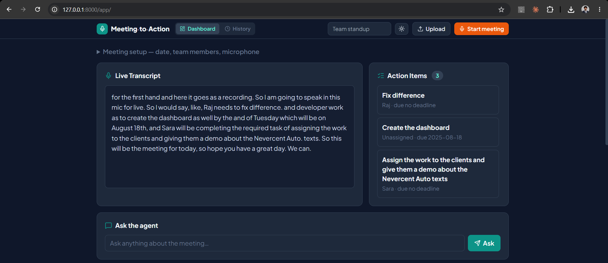
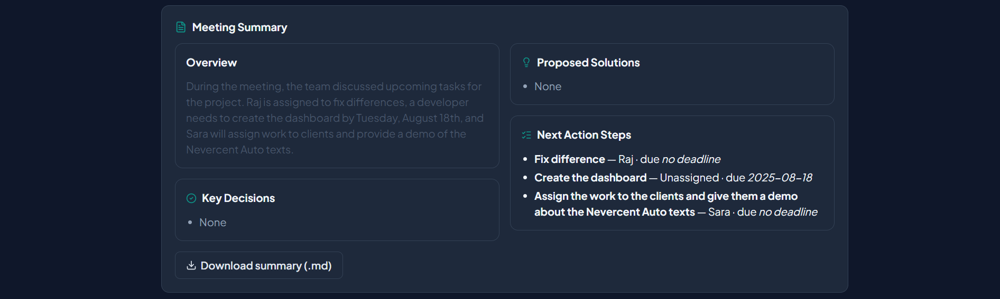
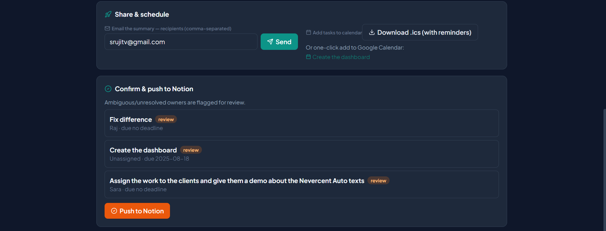
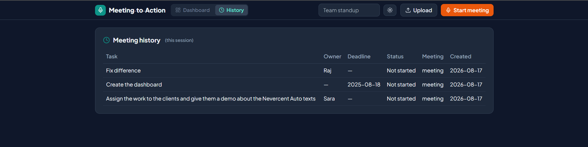

# Meeting-to-Action Agent

Turn any meeting into tracked, owner-assigned tasks. Speak into a live mic or paste a transcript, and an LLM extracts the summary, decisions, and action items as strict structured JSON. You review and confirm, then tasks land in Notion, get exported to your calendar, or go out as an email summary. Stale tasks get nudged. A human confirms before any external write, and ambiguous ownership is flagged rather than guessed.

> **LLM:** Runs on the Google Gemini free tier (zero cost, no card required), using structured JSON output for reliable, parseable extraction.

> The reasoning behind each decision lives in [`srujit/`](./srujit): the [PRD](./srujit/meeting-to-action-agent-prd.md), the [brainstorm and decision log](./srujit/BRAINSTORM.md), and the [Notion setup guide](./srujit/NOTION_SETUP.md). Start there.

---

## Problem

Every team runs on meetings, and every meeting tends to produce the same silent failure: decisions get made, someone says "I'll handle it," and then nothing tracks it. Action items live in scattered notes, ownership is fuzzy ("we should probably..."), and follow-through depends on whoever remembers. Turning a conversation into accountable, tracked tasks is manual, tedious, and usually skipped, so things quietly fall through.

The real problem isn't transcription. It is faithfully extracting commitments and owners from messy natural speech, and doing it in a way people can trust: no invented tasks, no guessed owners, no silent actions on your Notion or inbox.

## User

- Individuals and small teams who run standups, client calls, and 1:1s and want the outcomes tracked without hiring a note-taker.
- Specifically the person who is tired of being the human task-router, the one re-reading notes after every call to figure out who owns what. This tool does the first pass, and the person stays the approver.

## Goal

Build an agent that is faithful, safe, and actually usable, not a transcription demo:

- Every action item is grounded in an exact source quote and never invented.
- Ownership is resolved against a known roster or explicitly flagged (`resolved`, `unresolved`, `ambiguous`, `none`) and never guessed.
- A human confirms before any external write (Notion push, email, nudge). The agent drafts, the person approves.
- Zero cost to run on the Google Gemini free tier.
- Voice and text share one pipeline, so live mic and pasted transcript converge downstream.

## Research and Observations

A few observations shaped the design:

- **Free-text LLM output is unusable for automation.** To route tasks reliably you need a strict, parseable contract, so extraction uses structured tool-call output validated against a Pydantic schema, not scraped prose.
- **The dangerous failure mode is confident hallucination.** An LLM will happily invent an owner or a deadline to fill a field. The prompt forbids it and the schema encodes an explicit `ambiguous` state, so "we don't know" is a first-class answer rather than a blank guess.
- **Trust comes from traceability.** Every action item carries the exact `source_quote` it came from, so a reviewer can verify in one glance instead of re-reading the transcript.
- **Autonomy without a human gate is a liability, not a feature.** Pushing to someone's Notion or emailing a client is irreversible. The system is built so nothing external happens without explicit confirmation. The follow-up checker drafts nudges and logs them, but never sends.
- **Free-tier constraints are real.** The Gemini free tier rate-limits at roughly 20 requests per minute, so rate-limit errors are caught and turned into a clear, human-readable message instead of a raw 429 traceback.

## Design Decisions

| Decision | Why |
| --- | --- |
| **FastAPI backend as the single brain; UIs are thin clients** | The React SPA and Streamlit app both just call `/api/*`. Business logic lives in one place, so a new frontend is a view, not a rewrite. |
| **LangGraph pipeline (`extract` then `resolve_owners`)** | Small, focused nodes that each return a partial state update. Easy to test, trace, and extend with new steps. |
| **Google Gemini for extraction (free tier)** | Gemini (`gemini-flash-lite-latest`) returns the `MeetingExtraction` schema via structured JSON output, so the whole system runs at zero cost. |
| **Structured output validated by Pydantic** | The model must call `record_meeting_extraction` with a schema mirroring `MeetingExtraction`. Invalid output raises a typed `ExtractionError`, never a silent bad task. |
| **Human-in-the-loop before every external write** | `/extract` returns items for review and writes nothing. Only `/confirm` pushes to Notion. Nudges are drafted, never auto-sent. This is the project's core safety principle. |
| **Owner resolution against a roster, with explicit statuses** | Names are matched case-insensitively to known owners. Anything unmatched or ambiguous sets `needs_review=true` so the UI can flag it. |
| **SQLite for MVP, one env var to Postgres/Supabase** | Confirmed tasks are persisted locally so the follow-up checker can reason about staleness. `DATABASE_URL` swaps the backend without code changes. |
| **APScheduler now, cloud cron later** | The same `check_stale_tasks()` runs on a local background scheduler in dev and can be triggered by a cloud cron in production, with no rewrite. |

## Final Solution: How It Works

```
 Voice (live mic, faster-whisper) ┐
                                  ├─► Transcript ─► LangGraph pipeline ─► Review (human) ─┬─► Notion
 Text (paste / upload)            ┘                     │                                 ├─► Email summary (SMTP)
                                            [ extract -> resolve owners ]                 └─► Calendar (.ics)
                                            (Google Gemini, strict JSON)                        │
                                                                                          Follow-up checker
                                                                                    (APScheduler drafts nudges,
                                                                                       never auto-sends)
```

- **Input:** paste or upload a transcript, or record live. `POST /api/transcribe` runs faster-whisper and returns text. Voice and text converge into the same downstream pipeline.
- **Extract:** `POST /api/extract` runs the LangGraph pipeline. The LLM returns a strict `MeetingExtraction`: summary, decisions, proposed solutions, action items (task, owner, deadline, source quote, confidence), and open questions. Malformed or empty transcripts short-circuit without wasting an LLM call.
- **Resolve owners:** each action item's owner is matched against the known roster. A match is set to `resolved`, a name that doesn't match becomes `unresolved`, and genuinely unclear cases become `ambiguous`. Anything uncertain sets `needs_review`. No owner is ever invented.
- **Review and confirm:** the UI shows every item with its source quote, and the human edits or approves. Only then does `POST /api/confirm` push to Notion and persist the tasks locally.
- **Distribute:** the same confirmed set can be emailed as an HTML summary (`/api/email-summary`, SMTP) or exported as a calendar file (`/api/calendar-ics`).
- **Ask:** `POST /api/ask` answers free-form questions grounded in the transcript.
- **Follow up:** an APScheduler job checks the local DB for tasks stale beyond the threshold and drafts Slack nudges (`GET /api/followups`) for a human to review. It never sends on its own.

## Features

- 🎙️ **Voice or text, one pipeline.** Live-mic capture via faster-whisper, or paste and upload. Both feed the identical extraction flow.
- 🧾 **Structured, faithful extraction.** Summary, decisions, proposed solutions, action items, and open questions as schema-validated JSON, not free text.
- 🔗 **Every task traces to a source quote.** Each action item carries the exact transcript line it came from.
- 🧑‍🤝‍🧑 **Owner resolution, never guessed.** Matched to a roster or explicitly flagged `resolved`, `unresolved`, `ambiguous`, or `none`.
- ✋ **Human-in-the-loop by design.** `/extract` writes nothing, and a person confirms before any Notion push, email, or nudge.
- 🗂️ **Notion sync.** Confirmed items become database rows (pinned to Notion API version `2022-06-28`).
- 📧 **Email summaries.** Send the recap and tasks as HTML over SMTP (Gmail App Password supported).
- 📅 **Calendar export.** Turn action items into an `.ics` file with events and reminders.
- 💬 **Ask-the-meeting Q&A.** Grounded questions answered from the transcript.
- 🔔 **Autonomous stale-task follow-up.** APScheduler drafts nudges for tasks untouched past the threshold. Drafts and logs only, never auto-sends.
- 💸 **Zero cost.** Runs entirely on the Google Gemini free tier.
- 🛡️ **Hardened against messy input.** Empty or too-short transcripts skip the LLM, and rate-limit (429) and parse errors surface as clear, typed messages.
- 🖥️ **Two UIs, same API.** A React and Tailwind SPA (served at `/app`) and a Streamlit app.
- 🧪 **24 tests.** Extraction hardening, owner resolution, offline pipeline, scheduler, API, and sharing.

## Tech Stack

| Layer | Technology |
| --- | --- |
| Language | Python 3.11 |
| API / runtime | FastAPI, Uvicorn |
| Orchestration | LangGraph (`extract` then `resolve_owners`), langchain-core |
| LLM | Google Gemini (`gemini-flash-lite-latest`, free tier) |
| Structured output | Pydantic v2 schema with tool / structured-JSON calls |
| Speech-to-text | faster-whisper (`base.en`, int8 on CPU), sounddevice |
| Integrations | Notion (notion-client), Slack (slack-sdk), SMTP email, iCalendar (.ics) |
| Database | SQLAlchemy 2.0, SQLite (MVP), Postgres/Supabase via `DATABASE_URL` |
| Scheduling | APScheduler (background stale-task check) |
| Frontend | React 18 + Vite + Tailwind SPA (served at `/app`), Streamlit app |
| Config | pydantic-settings (`.env`-driven) |
| Observability | Langfuse hooks |
| Quality | pytest |

## Screenshots / Demo

A full run takes about a minute: record or paste a meeting, let Google Gemini extract the structure, review it, and push the confirmed tasks to Notion.

**1. Capture and extract.** Record live from the mic or paste a transcript. The Live Transcript shows on the left, and the extracted Action Items appear on the right. You can also ask the agent a question grounded in the meeting.



**2. Structured summary.** Google Gemini returns a full result: an Overview that catches you up on the whole meeting, Key Decisions, Proposed Solutions, and Next Action Steps with each owner and deadline. The summary downloads as Markdown.



**3. Share, then confirm to Notion.** Email the summary, export the tasks to a calendar file (`.ics`) or Google Calendar, and push to Notion. Ambiguous or unresolved owners are flagged with a `review` tag, so nothing is guessed and nothing leaves the app until you approve.



**4. History.** Confirmed tasks are saved locally and listed with owner, deadline, status, and source meeting. This is also what the stale-task follow-up checker reads from.



## How to Run Locally

### 1. Setup

```bash
python -m venv .venv
.venv\Scripts\activate            # Windows (PowerShell: .venv\Scripts\Activate.ps1)
                                  # macOS/Linux: source .venv/bin/activate
pip install -r requirements.txt

copy .env.example .env            # Windows (cp on macOS/Linux), then fill in keys
```

Fill in `.env`:

1. **Google Gemini API key** as `GEMINI_API_KEY` (free, no card, at https://aistudio.google.com/apikey). Keep `LLM_PROVIDER=gemini`.
2. **Notion:** follow [`srujit/NOTION_SETUP.md`](./srujit/NOTION_SETUP.md) for `NOTION_API_KEY` and `NOTION_DATABASE_ID`, then verify with `python scripts/test_notion.py`.
3. **Email summaries (optional):** set the SMTP block. For Gmail, enable 2FA, create an [App Password](https://myaccount.google.com/apppasswords), and use the 16 characters with no spaces as `SMTP_PASSWORD`.
4. **Slack nudges (optional):** set `SLACK_BOT_TOKEN` and `SLACK_DEFAULT_CHANNEL`.

### 2. Run

```bash
uvicorn app.main:app --reload     # backend and React SPA at http://localhost:8000/app
```

The FastAPI app initializes the DB, mounts the built React UI at `/app`, and starts the follow-up scheduler on boot. If you prefer Streamlit, run it in a second terminal:

```bash
streamlit run frontend/streamlit_app.py
```

Then paste `tests/sample_transcripts/standup_example.txt`, click **Extract**, review the items (each with its source quote), and confirm to push.

> **Rebuilding the React UI** (only if you change `frontend-react/`):
> ```bash
> cd frontend-react && npm install && npm run build   # outputs to frontend-react/dist
> npm run dev                                          # or hot-reload dev server
> ```

### 3. Test

```bash
pytest                            # 24 tests, hermetic, no API keys needed
```

The offline pipeline test and extraction-hardening tests run without any LLM keys.

## API Surface

All routes are under `/api`:

| Method and path | Purpose | External write? |
| --- | --- | --- |
| `POST /extract` | Transcript to structured `MeetingExtraction` for review | No |
| `POST /confirm` | Push human-approved items to Notion and persist locally | Yes (Notion) |
| `POST /transcribe` | Audio file to transcript (faster-whisper) | No |
| `POST /ask` | Answer a question grounded in the transcript | No |
| `POST /email-summary` | Send the summary as HTML over SMTP | Yes (email) |
| `POST /calendar-ics` | Build an `.ics` from action items | No |
| `GET  /history` | Past confirmed tasks, newest first | No |
| `GET  /followups` | Drafted nudges for stale tasks (review before send) | No |

## Folder Structure

```text
Meeting-to-action/
  app/                    # the single brain (FastAPI)
    main.py               #   app entrypoint: DB init, mounts /app, starts scheduler
    config.py             #   pydantic-settings, all .env-driven config
    api/routes.py         #   REST surface (/extract, /confirm, /ask, /email-summary, ...)
    graph/                #   LangGraph pipeline: state, nodes (extract, resolve_owners), build
    agents/               #   extraction.py (LLM to MeetingExtraction), qa.py (ask-the-meeting)
    schemas/models.py     #   the data contract: MeetingExtraction / ActionItem / OwnerStatus
    integrations/         #   notion.py, slack.py, email.py, calendar.py
    stt/transcriber.py    #   faster-whisper live/upload transcription
    scheduler/followup.py #   APScheduler stale-task check (drafts nudges, never sends)
    db/                   #   SQLAlchemy models, session, init
  frontend-react/         # React 18 + Vite + Tailwind SPA (built to dist/, served at /app)
  frontend/               # Streamlit app (alternative UI)
  web/                    # minimal static entry
  scripts/                # test_notion.py, run_extraction.py, diagnose_mic.py, find_database.py
  tests/                  # 24 tests plus sample_transcripts/
  srujit/                 # PRD, BRAINSTORM decision log, NOTION_SETUP guide
  requirements.txt
```

## Design Principle

A human confirms before any external write: pushing tasks to Notion, sending an email, or firing a nudge. Ambiguous ownership is flagged rather than guessed. Every extracted item carries the exact source quote it came from. The full rationale is in [`srujit/BRAINSTORM.md`](./srujit/BRAINSTORM.md) and the [PRD](./srujit/meeting-to-action-agent-prd.md).

## What I Learned

- **A strict schema is the whole game.** The moment extraction became a validated `MeetingExtraction` instead of prose, everything downstream (Notion rows, owner resolution, review UI) got simple and reliable.
- **Encode "I don't know" as a real state.** Giving ownership an explicit `ambiguous` value did more for trust than any prompt tweak, because it stopped the model from filling blanks with guesses.
- **Human-in-the-loop is a design constraint, not a TODO.** Building the API so `/extract` cannot write anything, and only `/confirm` can, made the safety guarantee structural instead of aspirational.
- **Free doesn't mean weak.** Gemini's structured JSON output on the free tier was reliable enough to run the whole extraction pipeline at zero cost.
- **Free tiers have sharp edges.** Catching the 429 quota case and turning it into a plain-English message was the difference between "looks broken" and "works, just wait a minute."

## Future Improvements

- **Two-way Notion sync:** read task status back so the follow-up checker reflects real progress, not just age.
- **Send nudges with approval:** a one-click "send these drafts" path from `/followups`, keeping the human gate.
- **Speaker diarization:** attribute transcript lines to speakers to sharpen owner resolution.
- **Production data and scheduling:** swap SQLite for Supabase/Postgres and APScheduler for cloud cron for an always-on agent.
- **Richer observability:** wire the Langfuse hooks into a dashboard for per-run traces and cost.
- **A hosted demo:** a clickable URL so reviewers can try it without cloning.

---
